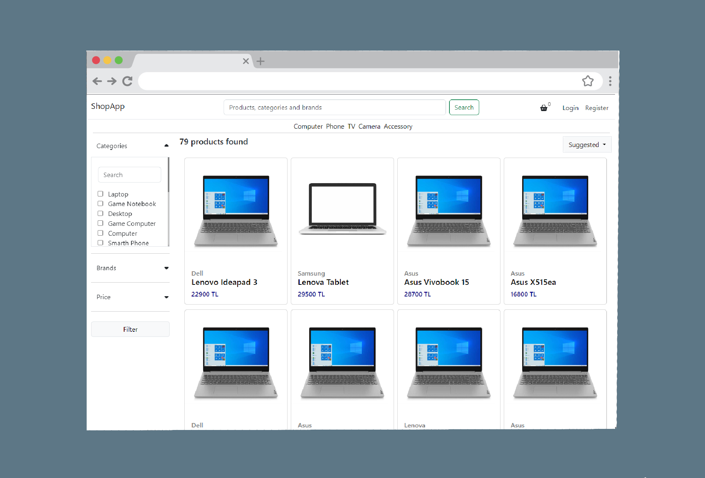

<hr>
<h6 align="center">
  <a href="https://shopapp.drawprogram.org">Shopapp</a>
</h6>
<hr>

<h3>Quick Start</h3>

<p>You can run shopapp with docker compose</p>

```
docker-compose up -d
```

<p>or you can run your local but you need mysql server and you should change connectionstring in appsetting.json</p>

```
npm install
dotnet run
```

<h3>Shopapp</h3>

<p class="mt-5">
Shopapp is a asp.net web mvc project where brands can sell their own products.It has a layered architectural structure. It supports user transactions.

</p>

<p>
    Technologies;
    <div style="max-width:36rem;">
        <table>
            <tbody>
                <tr>
                    <td scope="row">Data Access :</td>
                    <td>Entity Framework Core</td>
                </tr>
                <tr>
                    <td scope="row">Logging : </td>
                    <td colspan="2">NLog</td>
                </tr>
                <tr>
                    <td scope="row">Validation : </td>
                    <td colspan="2">Fluent Validation</td>
                </tr>
                <tr>
                    <td scope="row">Map : </td>
                    <td colspan="2">AutoMapper</td>
                </tr>
                <tr>
                    <td scope="row">User operation : </td>
                    <td colspan="2">Identity</td>
                </tr>
            </tbody>
        </table>
    </div>
    
</p>